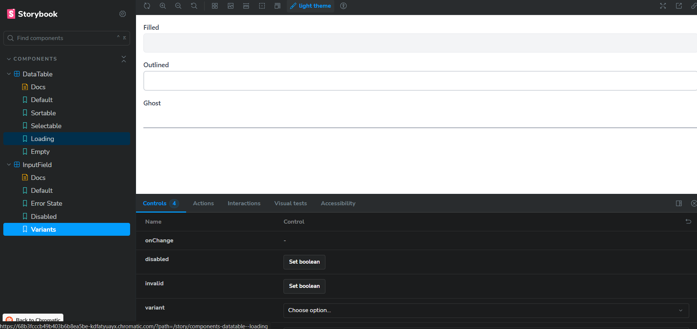

# React Component Library

A modern React component library built with TypeScript, Tailwind CSS, and Storybook.

## 📸 Preview

### InputField Component

*InputField with label, placeholder, and helper text*


*Different InputField variants: filled, outlined, and ghost*

### DataTable Component

*Sortable DataTable with sample data*

## 🚀 Quick Start

### Prerequisites
- Node.js 20.19+ or 22.12+
- npm or yarn

### Installation

```bash
# Clone the repository
git clone <repository-url>
cd uzence-intern

# Install dependencies
npm install
```

## 📦 Available Scripts

```bash
# Development
npm run dev              # Start Vite dev server
npm run storybook        # Start Storybook on port 6006

# Testing
npm run test             # Run tests in watch mode
npm run test:run         # Run tests once

# Build & Quality
npm run build            # Build for production
npm run lint             # Run ESLint
npm run preview          # Preview production build
```

## 🎨 Storybook

View and interact with components in Storybook:

```bash
npm run storybook
```

Features:
- 🌙 Dark/Light theme switcher
- 📱 Responsive design testing
- ♿ Accessibility testing
- 📖 Interactive documentation

## 🧩 Components

### InputField
Flexible input component with multiple variants and states.

```tsx
import { InputField } from './components/InputField';

<InputField
  label="Username"
  placeholder="Enter username"
  variant="outlined"
  size="md"
/>
```

**Props:**
- `variant`: `'filled' | 'outlined' | 'ghost'`
- `size`: `'sm' | 'md' | 'lg'`
- `invalid`: boolean for error state
- `disabled`: boolean for disabled state

### DataTable
Sortable and selectable data table component.

```tsx
import { DataTable } from './components/DataTable';

const columns = [
  { key: 'id', title: 'ID', dataIndex: 'id', sortable: true },
  { key: 'name', title: 'Name', dataIndex: 'name', sortable: true },
];

<DataTable
  data={data}
  columns={columns}
  selectable
  onRowSelect={(rows) => console.log(rows)}
/>
```

## 🎯 Tech Stack

- **React 19** - UI library
- **TypeScript** - Type safety
- **Tailwind CSS** - Styling
- **Vite** - Build tool
- **Storybook** - Component documentation
- **Vitest** - Testing framework
- **React Testing Library** - Component testing

## 🧪 Testing

Tests are written using Vitest and React Testing Library:

```bash
# Run all tests
npm run test:run

# Run tests in watch mode
npm test
```

Current test coverage:
- ✅ InputField component (5 tests)
- ✅ DataTable component (5 tests)

## 🌙 Dark Mode

All components support dark mode out of the box using Tailwind's dark mode classes. Toggle themes in Storybook to see components adapt automatically.

## 📁 Project Structure

```
src/
├── components/          # React components
│   ├── InputField.tsx
│   ├── DataTable.tsx
│   └── __tests__/       # Component tests
├── stories/             # Storybook stories
└── test/                # Test utilities

.storybook/              # Storybook configuration
```

## 🤝 Contributing

1. Create a new component in `src/components/`
2. Add corresponding tests in `src/components/__tests__/`
3. Create Storybook stories in `src/stories/`
4. Run tests and linting before committing
